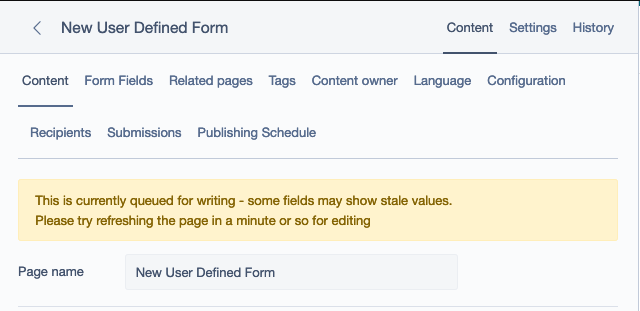

# SilverStripe Asynchronous Publishing

[](https://circleci.com/gh/andrewandante/silverstripe-async-publisher/tree/main)

Pushes writing and publishing to a Queued Job to avoid in-browser timeouts

## Installation

Add the following to your `composer.json`:

```json
{
    "require": {
        "andrewandante/silverstripe-async-publisher": "dev-main"
    },
    "repositories": [
        {
            "type": "vcs",
            "url": "git@github.com:andrewandante/silverstripe-async-publisher.git"
        }
    ]
}
```

then run `composer update andrewandante/silverstripe-async-publisher`

Once the module is installed, simply apply `AndrewAndante\SilverStripe\AsyncPublisher\Extension\AsyncPublisherExtension`
to any classes that you wish to enable Queued Publishing for:

```yaml
---
name: async-publisher-config
---
My\SuperSlow\Page:
  extensions:
      - AndrewAndante\SilverStripe\AsyncPublisher\Extension\AsyncPublisherExtension
```

This will apply it by default to all instances of that class. You can make this a little more configurable
using the `shouldPreferAsync()` method in an extension; for example, you might attach the below to `UserDefinedForm`:

```php
<?php

namespace My\App\Extensions;

use SilverStripe\Core\Extension;

class ShouldPreferAsyncExtension extends Extension
{
    public function shouldPreferAsync()
    {
        return $this->owner->Fields()->count() >= 20;
    }
}
```

Which will default to Queueing if there are 20 or more fields on the User Defined form, but otherwise
simply add the queueing actions to the "more options" menu

## Features

- replaces the "Save" and "Publish" buttons with "Queue Save" and "Queue Publish"
- adds "Save immediately" and "Publish immediately" to the "More Options" menu (in case of emergency)
- prevents editing while jobs are in the queue to prevent weird race conditions

## Screenshots




## TODOS

- test better with Unpublish and Archive
- have a better representation of state when there are pending jobs
- make it more configurable/extensible in general

## Maintainers

 * Andrew Paxley <andrew.paxley@silverstripe.com>
